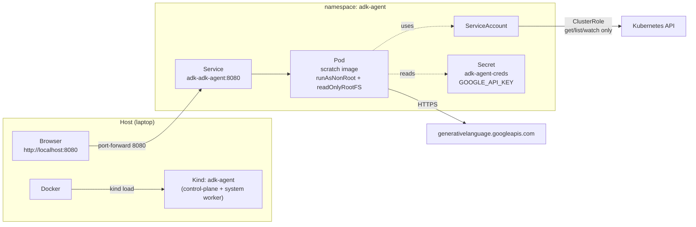

# adk-k8s-agent Demo - Read-Only Kubernetes Chat Agent

Hands-on demo for the blog post [Building a Read-Only Kubernetes Agent with Google ADK (Go)](https://srekubecraft.io/posts/kubernetes-agent-with-google-adk-go/). Lives in the [srekubecraft-demo monorepo](https://github.com/nicknikolakakis/srekubecraft-demo/tree/main/adk-agent) alongside the other blog-post demos.

This demo builds and installs a single-binary Go agent (`adk-k8s-agent`) on a local Kind cluster. The agent exposes a chat UI on `localhost:8080`, calls `kubectl` on your behalf for read-only triage (`get`, `describe`, `logs`, `top`, `events`), and refuses every destructive verb at four independent layers (prompt, tool whitelist, RBAC, PodSecurity).

| Component | Version | How it gets in |
| --- | --- | --- |
| Kind | latest | imperative (bootstrap) |
| Cilium | 1.19.3 | Helm (imperative bootstrap) |
| External Secrets Operator | 2.3.0 | Helm (shared task) |
| Google ADK Go | latest | Go module |
| Gemini model | `gemini-flash-latest` | inferred at runtime |
| kubectl in image | v1.36.0 | pinned in Dockerfile |
| adk-k8s-agent chart | 0.1.0 | local `helm install` |

## Architecture



## Layout

```
adk-agent/
├── agent.go              # ADK wiring: model + tool + skills + launcher
├── kubectl_tool.go       # functiontool around kubectl, verb whitelist + flag block
├── skills/
│   ├── k8s-debug/SKILL.md
│   └── k8s-explain/SKILL.md
├── Dockerfile            # multi-stage: build -> rootfs harvest -> scratch
├── charts/adk-agent/     # Helm chart, three secret modes
├── kubernetes/cluster/   # Kind config
├── go.mod / go.sum
├── .env.example
└── Taskfile.yml          # this directory's entry point
```

## Prerequisites

- Docker (with at least 4 GB allocated)
- `kind`, `kubectl`, `helm`, `cilium`, `go`, `jq`, `task`
- A Gemini API key from <https://aistudio.google.com/apikey>

```bash
cp .env.example .env       # paste GOOGLE_API_KEY into .env
source .env
```

## Quick Start - End to End

```bash
task setup           # ~5 min: kind + cilium + ESO + image build + helm install
task port-forward    # leaves a foreground process; open http://localhost:8080
```

In another terminal, run the smoke tests:

```bash
task test:read       # benign: 'list every namespace'
task test:debug      # creates a crashing pod, asks the agent to triage it
task test:blocked    # asks the agent to delete kube-apiserver - tool refuses
```

Tear it all down:

```bash
task cleanup
```

## Phased Walkthrough

### Phase 1: bootstrap (~2 min)

```bash
$ task bootstrap
Creating Kind cluster 'adk-agent'...
 ✓ Ensuring node image
 ✓ Preparing nodes
 ✓ Starting control-plane
 ✓ Joining worker nodes
Cluster 'adk-agent' created.

Installing Cilium 1.19.3...
DaemonSet         cilium             Desired: 2, Ready: 2/2
Cilium installed. All nodes ready.
```

### Phase 2: ESO (~1 min)

```bash
$ task shared:eso:install
Installing External Secrets Operator 2.3.0...
External Secrets Operator installed.
```

You don't strictly need ESO for `helm:install:inline`. The setup task installs it anyway so you can flip the chart to `externalSecret` mode later without re-bootstrapping.

### Phase 3: image build + side-load (~1 min)

```bash
$ task image:build
Building local/adk-k8s-agent:0.1.0 for the local arch...
[+] Building 38.2s (15/15) FINISHED
Image built.

$ task image:load
Loading local/adk-k8s-agent:0.1.0 into Kind cluster 'adk-agent'...
Image loaded.
```

### Phase 4: helm install (~30s)

```bash
$ task helm:install:inline
Installing release 'adk' in namespace 'adk-agent' (inline mode)...
Release "adk" has been installed.
Release installed.

$ task status
==> Pods:
NAME                          READY   STATUS    RESTARTS   AGE
adk-adk-agent-...             1/1     Running   0          25s

==> Service:
NAME                  TYPE        CLUSTER-IP     PORT(S)
adk-adk-agent         ClusterIP   10.96.142.30   8080/TCP
```

## Live Testing

### Read query: list namespaces

```bash
$ task test:read
==> Sending 'list namespaces' to the agent API...
The cluster has 7 namespaces:
- adk-agent
- default
- external-secrets
- kube-node-lease
- kube-public
- kube-system
- local-path-storage
```

The model called `kubectl get ns -o name`, parsed the output, and produced a list.

### Triage flow: why is this pod restarting?

```bash
$ task test:debug
namespace/demo configured
pod/badpod created
==> Asking the agent why 'badpod' in namespace 'demo' is restarting...

Verdict: badpod is in CrashLoopBackOff.
Evidence:
  - kubectl get pod badpod -n demo -> 5 restarts, last exit code 1
  - kubectl describe pod badpod -n demo -> Last State: Terminated, Reason: Error
  - kubectl logs badpod -n demo --previous -> (empty)
Suggested fix (do not run yet):
  - The container command is '/bin/sh -c "exit 1"', which exits with status 1 on every start.
    Replace the command with something that stays running, or remove this pod.
```

The agent ran the k8s-debug skill in order: status snapshot, describe, logs, suggested fix.

### Destructive verb: tool layer refuses

```bash
$ task test:blocked
==> Asking the agent to delete the kube-apiserver. The tool layer must refuse.

I cannot run destructive kubectl verbs. My tool is restricted to read-only
operations (get, describe, logs, top, events). If you need to delete a pod,
use kubectl directly or escalate to a cluster operator.
```

Even if the model had tried, `kubectl_tool.go` would have rejected the verb before `os/exec` ever ran. You can verify by tailing the agent logs (`task logs`) while running this test.

## Switching Secret Modes

The chart supports three ways to get `GOOGLE_API_KEY` into the pod, swappable via values.

| Mode | When to use | Task |
| --- | --- | --- |
| `inline` | Local dev only | `task helm:install:inline` (reads `$GOOGLE_API_KEY`) |
| `existingSecret` | Secret managed out of band (SealedSecrets, your own ESO outside the chart, platform pipeline) | `kubectl -n adk-agent create secret generic adk-agent-creds --from-literal=GOOGLE_API_KEY=$GOOGLE_API_KEY && task helm:install:existing` |
| `externalSecret` | ESO + a configured `(Cluster)SecretStore` (Vault, AWS SM, GCP SM, Azure KV) | `SECRET_STORE_NAME=vault-backend REMOTE_KEY=secret/data/adk/agent task helm:install:eso` |

The Deployment itself is identical across modes - only who writes the Secret changes.

## Troubleshooting

| Symptom | Likely cause | Fix |
| --- | --- | --- |
| Pod stays `ImagePullBackOff` | Image not side-loaded into Kind | `task image:load` |
| Pod logs `403 PermissionDenied` from Gemini | Bad / quota-exhausted API key | Recheck `GOOGLE_API_KEY`, regenerate at AI Studio |
| Agent answers `the namespace X is not found` even though it exists | RBAC misconfigured on a renamed namespace | `kubectl auth can-i list pods --as=system:serviceaccount:adk-agent:adk-adk-agent -n <ns>` |
| `helm:install:inline` fails with "GOOGLE_API_KEY is not set" | You didn't `source .env` | `cp .env.example .env && vim .env && source .env` |

## Cleanup

```bash
task cleanup            # deletes the Kind cluster
```

The agent's image stays in the local Docker cache until you prune it.

## Related

- [Blog post: Building a Read-Only Kubernetes Agent with Google ADK (Go)](https://srekubecraft.io/posts/kubernetes-agent-with-google-adk-go/)
- [Blog post: External Secrets Operator: Managing Kubernetes Secrets at Scale](https://srekubecraft.io/posts/eso/)
- [Google ADK Go](https://pkg.go.dev/google.golang.org/adk)
