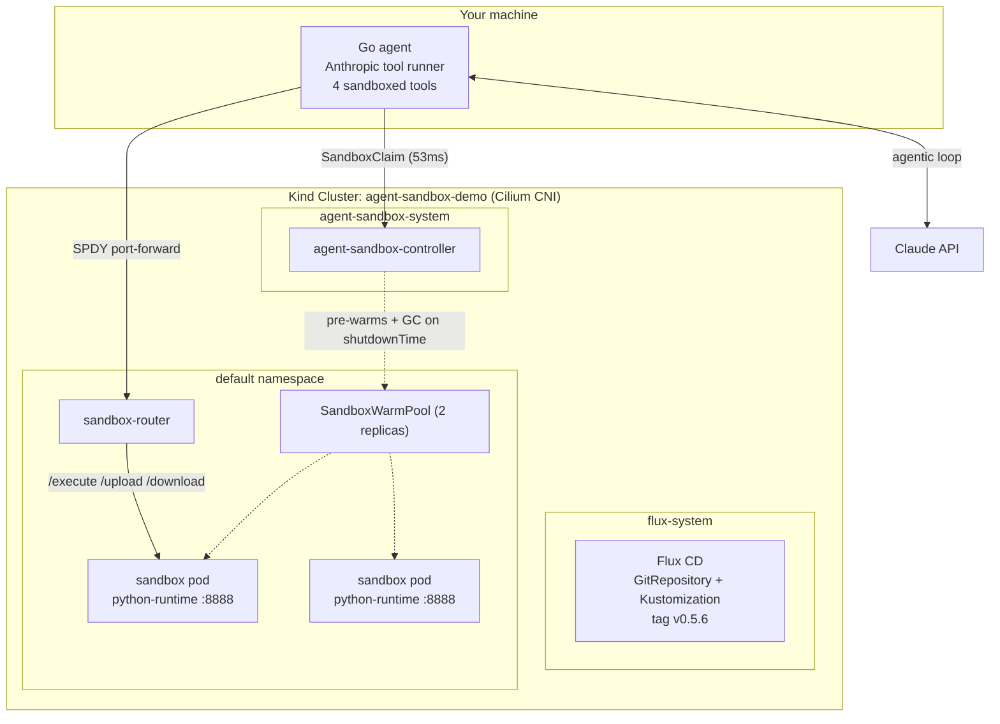

# Agent Sandbox Demo - Sandboxed Tools for a Go Agent on Kubernetes

Hands-on demo for the blog post on [agent-sandbox](https://agent-sandbox.sigs.k8s.io/), the Kubernetes SIG Apps project for isolated, stateful, singleton workloads - built for AI agent runtimes.

A small Go agent (Anthropic Go SDK tool runner + Claude) whose tools - `run_command`, `write_file`, `read_file`, `list_files` - all execute inside a sandbox pod claimed from a pre-warmed `SandboxWarmPool`. The agentic loop runs on your machine; every piece of LLM-generated code runs inside the cluster, behind a controller-managed NetworkPolicy.

| Component | What it is | Version |
| --- | --- | --- |
| agent-sandbox controller + extensions | `Sandbox`, `SandboxTemplate`, `SandboxWarmPool`, `SandboxClaim` CRDs + controller | `v0.5.6` |
| sandbox-router | Proxies SDK exec/file calls into sandbox pods | `latest-main` (digest-pinned) |
| python-runtime sandbox | FastAPI `/execute` server the SDK talks to | `latest-main` (digest-pinned) |
| Go SDK | `sigs.k8s.io/agent-sandbox/clients/go/sandbox` | `v0.5.6` |
| LLM | Claude via `github.com/anthropics/anthropic-sdk-go` tool runner | Claude Opus 5 |

**What this demo proves:** the full agent-sandbox flow - warm pool claims in ~50ms (vs ~10s cold), TTL-based garbage collection via `spec.lifecycle`, and the isolation model (LLM code cannot reach cluster IPs, only the internet).

**What it does NOT prove:** kernel-level isolation. On kind there is no gVisor/Kata `RuntimeClass`; on a real cluster set `runtimeClassName` in the `SandboxTemplate`.

## Architecture



## Prerequisites

- Docker, `kind`, `kubectl`, `helm`, `cilium` CLI, `flux` CLI, `task`, `jq`
- Go 1.26+
- `ANTHROPIC_API_KEY` exported (for the agent; the infra needs none)

## Quickstart

```bash
# full setup: cluster + Cilium + Flux + controller + router + warm pool
task up

# run the agent
export ANTHROPIC_API_KEY="sk-ant-..."
task agent:run -- "write a python script that prints the first 10 fibonacci numbers and run it"

# watch the claim/sandbox lifecycle in another terminal
task sandbox:status
```

The agent prints each tool call as it executes, the claim-to-ready latency, and Claude's final summary. With `-keep` the sandbox stays alive and is garbage-collected by the controller 5 minutes after the last tool call (`spec.lifecycle.shutdownTime`, extended on every call).

## Gotchas found while building this

1. **The upstream `k8s/` kustomization ships `ko://` image refs.** They only resolve inside the release pipeline; deploying the source tree gives `InvalidImageName`. Fix: kustomize `images:` transformer in the Flux Kustomization rewriting to `registry.k8s.io/agent-sandbox/agent-sandbox-controller`, pinned to digest.
2. **Router namespace: two components disagree.** The install guide deploys the router to `agent-sandbox-system`, but the Go SDK's port-forward mode resolves `sandbox-router-svc` in the *claim* namespace. The router lives in `default` here.
3. **The controller's auto-created NetworkPolicy only admits the router from `agent-sandbox-system`.** With the router moved to `default`, sandbox traffic is silently dropped (504 from the router). NetworkPolicies are additive: `kubernetes/sandbox/netpol.yaml` grants the extra allow without touching the controller-owned policy.
4. **`/execute` is not a shell.** Commands are exec'd (shlex-style): pipes, `&&`, redirection, `$VARS` are passed literally. The agent's system prompt tells Claude to wrap shell syntax in `sh -c "..."`.
5. **The SDK's `Write()` accepts plain filenames only** - no directory separators. Anything path-shaped goes through `run_command`.

## Testing without an API key

The smoke test exercises the whole sandbox path (claim, exec, file round-trip, TTL patch) with no LLM:

```bash
cd agent && SANDBOX_SMOKE=1 go test -v -run TestSandboxSmoke
```

## Cleanup

```bash
task down   # deletes the kind cluster
```
