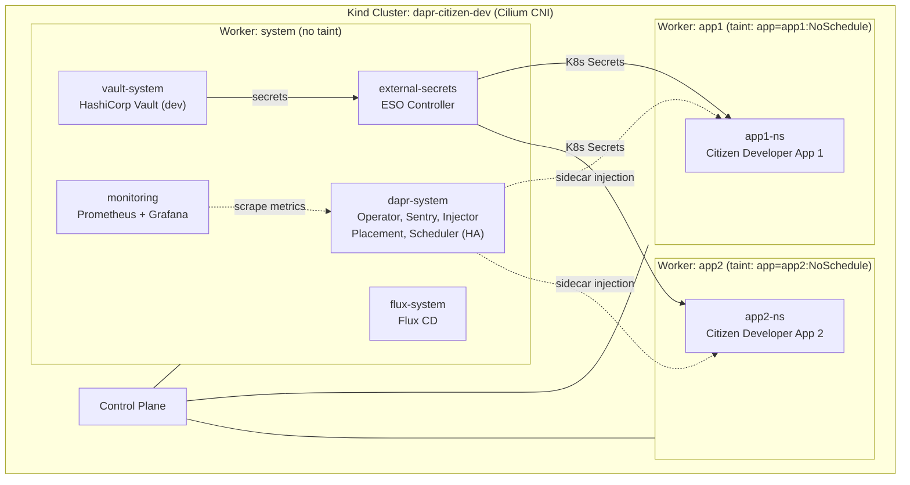
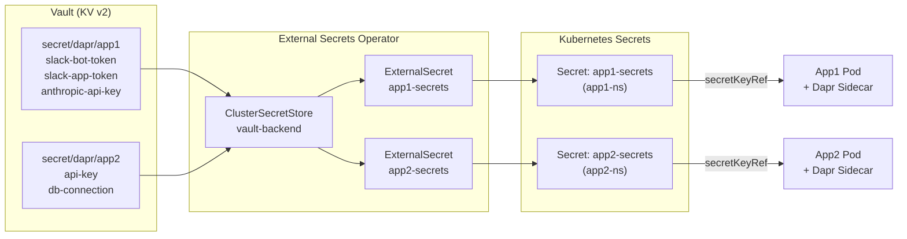

# Dapr Demo — Citizen Developer Platform on Kubernetes

Hands-on demo for the blog post [Dapr - Building a Safe Platform for Citizen Developer Apps on Kubernetes](https://srekubecraft.io/posts/dapr/).

This demo builds a **dedicated Kubernetes cluster** for hosting apps created by non-technical users (citizen developers) who build Python apps with AI assistants like Claude. The platform uses **Dapr** as the distributed application runtime, **Vault** for secrets management, **External Secrets Operator** for syncing secrets to Kubernetes, and **dedicated node pools** (simulated via Kind worker labels and taints) for workload isolation.

## Architecture



### Secrets flow



### Node isolation (simulating GKE dedicated node pools)

| Node | Label | Taint | Purpose |
| --- | --- | --- | --- |
| worker (system) | `workload=system` | None | Infrastructure: Dapr, Vault, ESO, monitoring |
| worker2 (app1) | `workload=apps, app=app1` | `app=app1:NoSchedule` | Dedicated to app1 |
| worker3 (app2) | `workload=apps, app=app2` | `app=app2:NoSchedule` | Dedicated to app2 |

App deployments use **tolerations** to schedule on their dedicated node and **nodeAffinity** to prefer it. The taints prevent other workloads from landing on app nodes.

## Prerequisites

| Tool | Version | Purpose |
| --- | --- | --- |
| [Docker](https://docs.docker.com/get-docker/) | 20+ | Container runtime for Kind |
| [Kind](https://kind.sigs.k8s.io/) | 0.20+ | Local Kubernetes cluster |
| [kubectl](https://kubernetes.io/docs/tasks/tools/) | 1.28+ | Kubernetes CLI |
| [Helm](https://helm.sh/docs/intro/install/) | 3.12+ | Package manager |
| [Cilium CLI](https://docs.cilium.io/en/stable/gettingstarted/k8s-install-default/#install-the-cilium-cli) | 0.15+ | CNI installation and health check |
| [Flux CLI](https://fluxcd.io/flux/installation/) | 2.0+ | GitOps controller |
| [Task](https://taskfile.dev/installation/) | 3.0+ | Task runner |
| [jq](https://jqlang.github.io/jq/download/) | 1.6+ | JSON processing (ESO status) |

## Quick Start

```bash
git clone https://github.com/nicknikolakakis/srekubecraft-demo.git
cd srekubecraft-demo/dapr

# Full setup: Kind cluster + Cilium + Prometheus/Grafana + Flux + ESO + Vault + Dapr
task setup
```

The setup takes approximately 5-8 minutes and installs the following in order:

1. **Kind cluster** — 1 control plane + 3 workers (with taints simulating dedicated node pools)
2. **Cilium** — eBPF-based CNI replacing kube-proxy
3. **Metrics Server** — Node and pod resource metrics
4. **kube-prometheus-stack** — Prometheus + Grafana for monitoring
5. **Flux CD** — GitOps controllers
6. **External Secrets Operator** — Syncs secrets from Vault to Kubernetes
7. **Vault** — HashiCorp Vault in dev mode, seeded with demo secrets for app1 and app2
8. **ESO configuration** — ClusterSecretStore + ExternalSecrets connecting Vault to app namespaces
9. **Dapr** — Distributed application runtime in HA mode (mTLS, Prometheus metrics)

### Alternative: Flux-based Dapr install

```bash
task setup:flux
```

Uses Flux HelmRelease to manage Dapr instead of direct Helm install. Same result, GitOps-managed.

## Verify the Setup

After `task setup` completes, run through these checks to confirm everything is healthy.

### 1. All pods running

```bash
kubectl get pods -A --field-selector status.phase!=Running
```

Expected: **no output** (all pods are Running). If you see pods in `Pending` or `ContainerCreating`, wait a minute and retry — some components need time to pull images on first run.

### 2. Cilium CNI

```bash
cilium status
```

Expected output:
```
    /¯¯\
 /¯¯\__/¯¯\    Cilium:             OK
 \__/¯¯\__/    Operator:           OK
 /¯¯\__/¯¯\    Envoy DaemonSet:    OK
 \__/¯¯\__/    Hubble Relay:       OK
    \__/       ClusterMesh:        disabled

DaemonSet         cilium             Desired: 4, Ready: 4/4
DaemonSet         cilium-envoy       Desired: 4, Ready: 4/4
Deployment        cilium-operator    Desired: 2, Ready: 2/2
Deployment        hubble-relay       Desired: 1, Ready: 1/1
Deployment        hubble-ui          Desired: 1, Ready: 1/1
```

All components should show `OK` and all DaemonSets/Deployments should be fully ready.

### 3. Dapr runtime

```bash
task dapr:status
```

Expected: **15 pods** running in `dapr-system` in HA mode:

| Component | Replicas | Purpose |
| --- | --- | --- |
| `dapr-operator` | 3 | Manages Dapr components and configurations |
| `dapr-sentry` | 3 | Certificate authority for mTLS |
| `dapr-sidecar-injector` | 3 | Mutating webhook that injects Dapr sidecars |
| `dapr-placement-server` | 3 | Actor placement (StatefulSet) |
| `dapr-scheduler-server` | 3 | Job scheduling (StatefulSet) |

> **Note:** You may see 1-2 restarts on operator/injector pods — this is normal during initial mTLS certificate bootstrapping.

### 4. Vault secrets

```bash
task vault:status
```

Expected:
```
==> Vault pods:
NAME                     READY   STATUS    RESTARTS   AGE
vault-67fc46c5f4-xxxxx   1/1     Running   0          5m

==> Vault secrets:
Keys
----
app1
app2
```

Both `app1` and `app2` secret paths should be listed, confirming the seed script ran successfully.

### 5. External Secrets Operator

```bash
task eso:status
```

Expected:
```
==> ClusterSecretStore:
NAME            AGE   STATUS   CAPABILITIES   READY
vault-backend   5m    Valid    ReadWrite      True

==> ExternalSecrets:
NAMESPACE   NAME           STORE           STATUS         READY
app1-ns     app1-secrets   vault-backend   SecretSynced   True
app2-ns     app2-secrets   vault-backend   SecretSynced   True

==> Synced K8s Secrets:
anthropic-api-key
slack-app-token
slack-bot-token

api-key
db-connection
```

Key things to verify:
- ClusterSecretStore is `Valid` and `Ready: True`
- Both ExternalSecrets show `SecretSynced` and `Ready: True`
- The synced secret keys match what was seeded in Vault

You can also verify the actual K8s secrets were created:

```bash
# Verify app1 secrets exist in app1-ns
kubectl get secret app1-secrets -n app1-ns -o jsonpath='{.data}' | jq 'keys'

# Verify app2 secrets exist in app2-ns
kubectl get secret app2-secrets -n app2-ns -o jsonpath='{.data}' | jq 'keys'
```

### 6. Node isolation

```bash
task nodes:status
```

Expected:
```
NAME                             WORKLOAD   APP      TAINTS
dapr-citizen-dev-control-plane   <none>     <none>   node-role.kubernetes.io/control-plane
dapr-citizen-dev-worker          system     <none>   <none>
dapr-citizen-dev-worker2         apps       app1     app
dapr-citizen-dev-worker3         apps       app2     app
```

Verify that:
- The **system** worker has no app taint — infrastructure pods (Dapr, Vault, ESO, monitoring) run here
- The **app1** and **app2** workers have the `app` taint — only pods with matching tolerations can schedule here
- App nodes show **minimal resource usage** (~0% CPU, ~5% memory) since no app workloads are deployed yet

You can also confirm that no infrastructure pods leaked onto the tainted app nodes:

```bash
# Should return NO pods (only Cilium and node-exporter DaemonSets are tolerated)
kubectl get pods -A --field-selector spec.nodeName=dapr-citizen-dev-worker2 \
  -o custom-columns='NAMESPACE:.metadata.namespace,NAME:.metadata.name'
```

### 7. Monitoring (Prometheus + Grafana)

```bash
task shared:monitoring:status
```

Expected: Prometheus operator, Grafana, kube-state-metrics, and node-exporter pods all running in the `monitoring` namespace.

Access Grafana dashboard:

```bash
kubectl port-forward -n monitoring svc/kube-prometheus-stack-grafana 3000:80
```

Open [http://localhost:3000](http://localhost:3000) and login with `admin` / `admin`. Verify the pre-installed dashboards load (e.g., "Kubernetes / Compute Resources / Cluster").

### 8. Flux CD

```bash
flux check
```

Expected:
```
✔ Kubernetes 1.35.0 >=1.33.0-0
✔ helm-controller: deployment ready
✔ kustomize-controller: deployment ready
✔ notification-controller: deployment ready
✔ source-controller: deployment ready
✔ all checks passed
```

### 9. Cluster events (no persistent errors)

```bash
kubectl get events -A --field-selector type!=Normal --sort-by='.lastTimestamp' | tail -10
```

You may see some **transient warnings** from the setup phase — these are expected and resolve on their own:

| Warning | Expected? | Explanation |
| --- | --- | --- |
| `FailedScheduling` (coredns, local-path) | Yes | Nodes had taints before Cilium was ready |
| `Unhealthy` (readiness/liveness probes) | Yes | Dapr components need time for mTLS cert bootstrapping |
| `ca cert not yet ready` (ESO webhooks) | Yes | ESO webhook certs are provisioned async |
| `ErrImagePull` (scheduler) | Rare | Transient network timeout pulling from ghcr.io |

**If you see persistent errors** (repeated every few seconds for >5 minutes), check the specific pod logs:

```bash
kubectl logs -n <namespace> <pod-name> --tail=50
```

## Project Structure

```
dapr/
├── Taskfile.yml                            # All tasks: setup, status, clean
├── README.md
├── kubernetes/
│   ├── cluster/
│   │   └── kind-config.yaml                # 4-node Kind: 1 CP + 3 workers (tainted)
│   ├── dapr/
│   │   └── dapr-config.yaml                # Dapr Configuration: mTLS, Prometheus metrics
│   ├── vault/
│   │   ├── vault-dev.yaml                  # Vault dev mode Deployment + Service
│   │   └── seed-secrets.sh                 # Seeds demo secrets into Vault KV v2
│   ├── eso/
│   │   ├── cluster-secret-store.yaml       # ClusterSecretStore → Vault connection
│   │   ├── app1-external-secret.yaml       # ExternalSecret: syncs app1 secrets
│   │   └── app2-external-secret.yaml       # ExternalSecret: syncs app2 secrets
│   └── flux/
│       ├── sources.yaml                    # HelmRepositories: Dapr, Cilium, metrics-server
│       └── dapr-release.yaml               # HelmRelease: Dapr HA via Flux
└── (coming soon)
    ├── app/                                # Sample citizen developer apps
    │   ├── app1/                           # Slack bot (Dapr + Claude)
    │   └── app2/                           # Calculator app (Dapr state)
    └── kubernetes/apps/                    # App deployments, network policies, resource quotas
```

## Available Tasks

| Task | Description |
| --- | --- |
| `setup` | Full setup: cluster + Cilium + monitoring + Flux + ESO + Vault + Dapr |
| `setup:flux` | Full setup with Flux-managed Dapr install |
| `dapr:status` | Check Dapr pods, configurations, and components |
| `vault:status` | Check Vault pods and list seeded secrets |
| `eso:configure` | Create ClusterSecretStore and ExternalSecrets |
| `eso:status` | Check ESO sync status and synced K8s secrets |
| `nodes:status` | Show node labels, taints, and resource usage |
| `shared:monitoring:status` | Check Prometheus and Grafana pods |
| `clean:apps` | Remove app namespaces (keep cluster and infra) |
| `clean` | Delete everything including the Kind cluster |

## Stack Versions

| Component | Version |
| --- | --- |
| Dapr | 1.17.5 |
| Cilium | 1.19.3 |
| HashiCorp Vault | 1.21 |
| External Secrets Operator | 2.3.0 |
| kube-prometheus-stack | 83.6.0 |
| Flux CD | 2.8.5 |
| Kubernetes (Kind) | 1.35.0 |

## Design Decisions

### Why a dedicated cluster?

Production Kubernetes clusters running your core product should not host citizen developer apps. Reasons:

- **Blast radius** — A misconfigured app from a non-technical user should not impact your product
- **Resource contention** — Citizen apps with unbounded resource usage can starve critical workloads
- **Security boundary** — Non-technical users should not have access to production secrets or APIs
- **Compliance** — Audit and access controls differ between product and internal tooling

### Why Dapr?

Dapr abstracts distributed system concerns (secrets, state, pub/sub, bindings) into simple APIs. This means:

- **Platform team** configures infrastructure (Vault connection, Redis state store, Slack bindings)
- **Citizen developers** call `dapr.get_secret()` or `dapr.save_state()` without knowing Vault or Redis exist
- **Sidecar model** keeps infrastructure logic out of app code

### Why ESO instead of Dapr's built-in secret store?

External Secrets Operator syncs Vault secrets to native Kubernetes Secrets. This provides:

- A single secrets pipeline for all workloads (not just Dapr apps)
- Automatic rotation via `refreshInterval`
- Familiar `secretKeyRef` in pod specs
- ClusterSecretStore scoping — platform team controls which Vault paths each namespace can access

### Why dedicated node pools (taints)?

Node taints prevent workloads from scheduling on the wrong node. Combined with tolerations and node affinity in app deployments:

- App1 pods only run on the app1 node
- App2 pods only run on the app2 node
- System pods (Dapr, Vault, monitoring) run on the system node
- No noisy-neighbor effects between apps

In production GKE, these become actual node pools with different machine types and autoscaling policies.

## Cleanup

```bash
# Remove app namespaces only (keep cluster and infrastructure)
task clean:apps

# Delete everything including the Kind cluster
task clean
```

## Blog Post

This demo accompanies the blog post: [Dapr - Building a Safe Platform for Citizen Developer Apps on Kubernetes](https://srekubecraft.io/posts/dapr/)

## License

See the repository root [LICENSE](../LICENSE) file.
