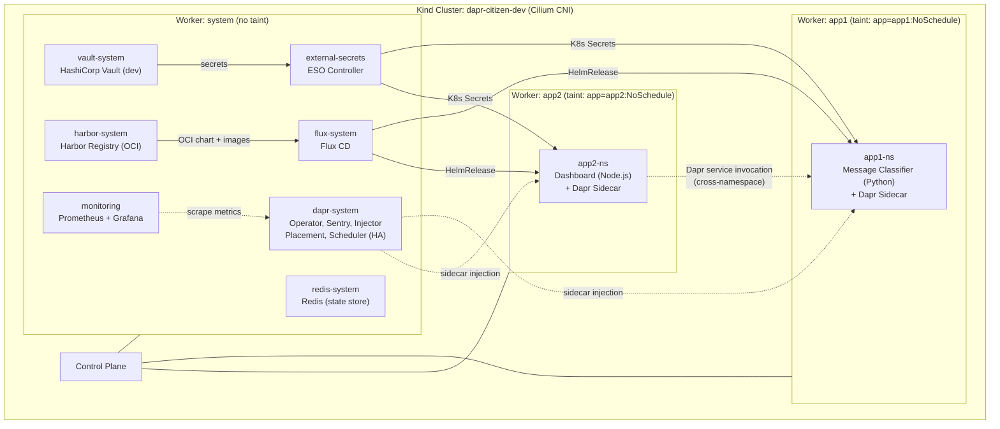
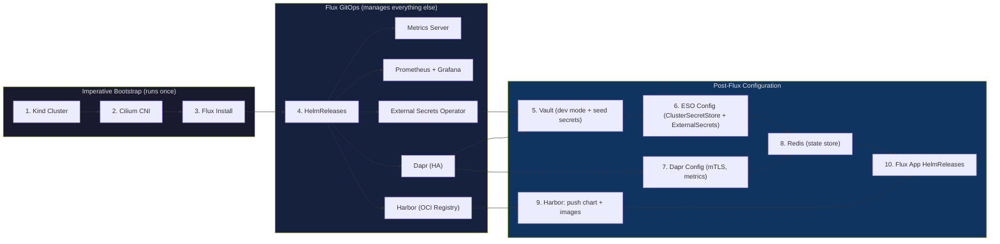
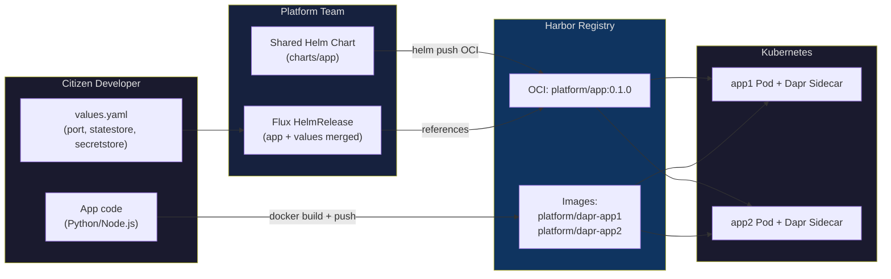
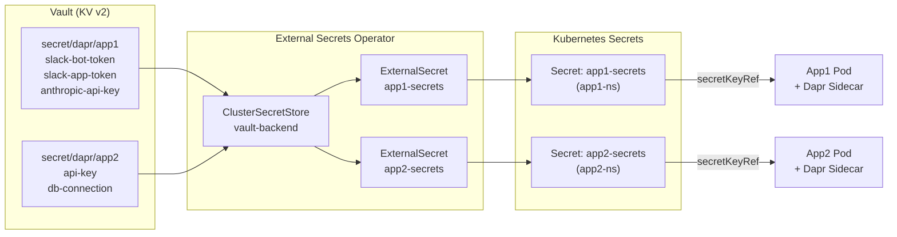

# Dapr Demo - Citizen Developer Platform on Kubernetes

Hands-on demo for the blog post [Dapr - Building a Safe Platform for Citizen Developer Apps on Kubernetes](https://srekubecraft.io/posts/dapr/).

This demo builds a **dedicated Kubernetes cluster** for hosting apps created by non-technical users (citizen developers) who build apps with AI assistants like Claude. The platform uses **Dapr** as the distributed application runtime, **Harbor** as the internal OCI registry, **Flux** for GitOps delivery, **Vault** for secrets management, **External Secrets Operator** for syncing secrets, and **dedicated node pools** (simulated via Kind worker labels and taints) for workload isolation.

## Architecture



### Setup flow - what's imperative vs GitOps



> **Why is Cilium imperative?** Cilium is the CNI - without it, no pod networking exists. Flux controllers themselves need networking to pull Helm charts, so Cilium must be installed before Flux can operate.

### App delivery flow - Harbor + Flux



### Secrets flow



### Node isolation (simulating GKE dedicated node pools)

| Node | Label | Taint | Purpose |
| --- | --- | --- | --- |
| worker (system) | `workload=system` | None | Infrastructure: Dapr, Vault, ESO, Harbor, monitoring |
| worker2 (app1) | `workload=apps, app=app1` | `app=app1:NoSchedule` | Dedicated to app1 |
| worker3 (app2) | `workload=apps, app=app2` | `app=app2:NoSchedule` | Dedicated to app2 |

App deployments use **tolerations** to schedule on their dedicated node and **nodeAffinity** to prefer it. The taints prevent other workloads from landing on app nodes.

## Prerequisites

| Tool | Version | Purpose |
| --- | --- | --- |
| [Docker](https://docs.docker.com/get-docker/) | 20+ | Container runtime for Kind + image builds |
| [Kind](https://kind.sigs.k8s.io/) | 0.20+ | Local Kubernetes cluster |
| [kubectl](https://kubernetes.io/docs/tasks/tools/) | 1.28+ | Kubernetes CLI |
| [Helm](https://helm.sh/docs/intro/install/) | 3.12+ | Package manager (Cilium bootstrap + chart push) |
| [Cilium CLI](https://docs.cilium.io/en/stable/gettingstarted/k8s-install-default/#install-the-cilium-cli) | 0.15+ | CNI installation and health check |
| [Flux CLI](https://fluxcd.io/flux/installation/) | 2.0+ | GitOps controller |
| [Task](https://taskfile.dev/installation/) | 3.0+ | Task runner |
| [jq](https://jqlang.github.io/jq/download/) | 1.6+ | JSON processing (ESO status) |

## Quick Start

```bash
git clone https://github.com/nicknikolakakis/srekubecraft-demo.git
cd srekubecraft-demo/dapr

# Full setup: bootstrap → Flux infra → Vault → ESO → Dapr → Redis → Harbor → apps
task setup
```

The setup takes approximately 10-12 minutes. Here's what happens:

### Phase 1: Imperative bootstrap

These three steps run imperatively because Flux needs networking to operate:

```bash
# Runs automatically as part of `task setup`
task bootstrap
```

1. **Kind cluster** - 1 control plane + 3 workers (with taints simulating dedicated node pools)
2. **Cilium** - eBPF-based CNI replacing kube-proxy (must be imperative - no pods without CNI)
3. **Flux CD** - GitOps controllers installed via `flux install`

### Phase 2: Flux GitOps (infrastructure)

Once Flux is running, it takes over. Five infrastructure HelmReleases are applied and Flux reconciles them:

```bash
# Runs automatically as part of `task setup`
task flux:apply
task flux:wait
```

| HelmRelease | Namespace | What Flux installs |
| --- | --- | --- |
| `metrics-server` | kube-system | Node and pod resource metrics |
| `kube-prometheus-stack` | monitoring | Prometheus + Grafana |
| `external-secrets` | external-secrets | External Secrets Operator |
| `dapr` | dapr-system | Dapr runtime in HA mode |
| `harbor` | harbor-system | Harbor OCI registry (NodePort 30000) |

### Phase 3: Post-Flux configuration

These resources depend on the Flux-managed components being ready:

```bash
# Runs automatically as part of `task setup`
task vault:install      # Deploy Vault + seed demo secrets
task eso:configure      # ClusterSecretStore + ExternalSecrets
task dapr:configure     # Dapr Configuration CR (mTLS, metrics)
task redis:install      # Redis for Dapr state store
```

### Phase 4: Harbor + app deployment

Harbor receives the shared Helm chart and container images. Flux HelmReleases deploy the apps, pulling the chart from Harbor's OCI registry:

```bash
# Runs automatically as part of `task setup`
task harbor:configure   # Configure containerd trust + push chart + images
task flux:apply:apps    # Apply app1 + app2 Flux HelmReleases
```

## Verify the Setup

After `task setup` completes, run through these checks to confirm everything is healthy.

### 1. All pods running

```bash
kubectl get pods -A --field-selector status.phase!=Running
```

Expected: **no output** (all pods are Running). If you see pods in `Pending` or `ContainerCreating`, wait a minute and retry - some components need time to pull images on first run.

### 2. Cilium CNI

```bash
cilium status
```

Expected:
```
    /¯¯\
 /¯¯\__/¯¯\    Cilium:             OK
 \__/¯¯\__/    Operator:           OK
 /¯¯\__/¯¯\    Envoy DaemonSet:    OK
 \__/¯¯\__/    Hubble Relay:       OK
    \__/       ClusterMesh:        disabled

DaemonSet         cilium             Desired: 4, Ready: 4/4
DaemonSet         cilium-envoy       Desired: 4, Ready: 4/4
Deployment        cilium-operator    Desired: 2, Ready: 2/2
Deployment        hubble-relay       Desired: 1, Ready: 1/1
Deployment        hubble-ui          Desired: 1, Ready: 1/1
```

### 3. Flux HelmReleases

```bash
task flux:status
```

Expected: All **7 HelmReleases** show `READY: True`:

```
NAMESPACE         NAME                  REVISION  SUSPENDED  READY  MESSAGE
app1-ns           app1                  0.1.0     False      True   Helm install succeeded...
app2-ns           app2                  0.1.0     False      True   Helm install succeeded...
dapr-system       dapr                  1.17.5    False      True   Helm install succeeded...
external-secrets  external-secrets      2.3.0     False      True   Helm install succeeded...
harbor-system     harbor                1.18.3    False      True   Helm install succeeded...
kube-system       metrics-server        3.13.0    False      True   Helm install succeeded...
monitoring        kube-prometheus-stack  83.6.0    False      True   Helm install succeeded...
```

### 4. Harbor registry

```bash
task harbor:status
```

Expected: Harbor is healthy and contains the `platform` project with `app`, `dapr-app1`, and `dapr-app2` artifacts.

Harbor UI is available at [http://localhost:30000](http://localhost:30000) (admin / Harbor12345).

### 5. Dapr runtime

```bash
task dapr:status
```

Expected: **15 pods** running in `dapr-system` in HA mode:

| Component | Replicas | Purpose |
| --- | --- | --- |
| `dapr-operator` | 3 | Manages Dapr components and configurations |
| `dapr-sentry` | 3 | Certificate authority for mTLS |
| `dapr-sidecar-injector` | 3 | Mutating webhook that injects Dapr sidecars |
| `dapr-placement-server` | 3 | Actor placement (StatefulSet) |
| `dapr-scheduler-server` | 3 | Job scheduling (StatefulSet) |

> **Note:** You may see 1-2 restarts on operator/injector pods - this is normal during initial mTLS certificate bootstrapping.

### 6. Vault secrets

```bash
task vault:status
```

Expected: Vault pod running, secrets `app1` and `app2` listed under `secret/dapr/`.

### 7. External Secrets Operator

```bash
task eso:status
```

Expected:
```
==> ClusterSecretStore:
NAME            AGE   STATUS   CAPABILITIES   READY
vault-backend   5m    Valid    ReadWrite      True

==> ExternalSecrets:
NAMESPACE   NAME           STORE           STATUS         READY
app1-ns     app1-secrets   vault-backend   SecretSynced   True
app2-ns     app2-secrets   vault-backend   SecretSynced   True

==> Synced K8s Secrets:
anthropic-api-key
slack-app-token
slack-bot-token

api-key
db-connection
```

### 8. App integration tests

```bash
# Test app1 - message classifier (Dapr state store + secret store)
task test:app1

# Test app2 - dashboard calling app1 via Dapr cross-namespace service invocation
task test:app2
```

Expected: health checks pass, classifications are stored in Redis via Dapr, app2 calls app1 across namespaces, pods run on their dedicated nodes.

### 9. Node isolation

```bash
task nodes:status
```

Expected:
```
NAME                             WORKLOAD   APP      TAINTS
dapr-citizen-dev-control-plane   <none>     <none>   node-role.kubernetes.io/control-plane
dapr-citizen-dev-worker          system     <none>   <none>
dapr-citizen-dev-worker2         apps       app1     app
dapr-citizen-dev-worker3         apps       app2     app
```

### 10. Monitoring (Prometheus + Grafana)

```bash
kubectl port-forward -n monitoring svc/kube-prometheus-stack-grafana 3000:80
# Open http://localhost:3000
# Login: admin / admin
```

### 11. Cluster events (no persistent errors)

```bash
kubectl get events -A --field-selector type!=Normal --sort-by='.lastTimestamp' | tail -10
```

You may see some **transient warnings** from the setup phase - these are expected:

| Warning | Expected? | Explanation |
| --- | --- | --- |
| `FailedScheduling` (coredns, local-path) | Yes | Nodes had taints before Cilium was ready |
| `Unhealthy` (readiness/liveness probes) | Yes | Dapr components need time for mTLS cert bootstrapping |
| `ca cert not yet ready` (ESO webhooks) | Yes | ESO webhook certs are provisioned async |
| `ErrImagePull` (scheduler) | Rare | Transient network timeout pulling from ghcr.io |

## The Apps

### App1 - Message Classifier (Python/Flask)

A citizen developer built a message classifier using Dapr's state store and secret store APIs. The app:

- **Classifies** incoming messages as `bug`, `feature_request`, or `question`
- **Stores** classification history in Redis via Dapr state API (`localhost:3500`)
- **Reads** API keys from Vault via Dapr secret API (`localhost:3500`)

The citizen developer never touches Redis, Vault, or mTLS - Dapr handles it all.

### App2 - Classification Dashboard (Node.js/TypeScript)

A second citizen developer built a web dashboard that:

- **Calls app1** via Dapr service invocation (no service URLs, no mTLS config)
- **Displays** classification results in a web UI
- **Works cross-namespace** - app2 in `app2-ns` calls app1 in `app1-ns` via `app1.app1-ns` Dapr app ID

### Shared Helm Chart

Both apps use the same Helm chart (`charts/app/`). The platform team maintains the chart, which handles:

- Dapr sidecar annotations
- Network policies (deny-all + allow Dapr + DNS + cross-namespace)
- Resource quotas per namespace
- Node affinity and tolerations for dedicated node pools
- Dapr components (statestore, secretstore, binding, pubsub)

Citizen developers only provide a `values.yaml` with their image, port, and which Dapr building blocks they need.

## Project Structure

```
dapr/
├── Taskfile.yml                              # All tasks (setup, test, harbor, flux, clean)
├── README.md
├── app/
│   ├── app1/                                 # Python/Flask message classifier
│   │   ├── app.py
│   │   ├── requirements.txt
│   │   ├── Dockerfile
│   │   └── .dockerignore
│   └── app2/                                 # Node.js/TypeScript dashboard
│       ├── src/
│       ├── package.json
│       ├── tsconfig.json
│       ├── Dockerfile
│       └── .dockerignore
├── apps/                                     # Per-app values (citizen developer inputs)
│   ├── app1/
│   │   └── values.yaml                       # image, port, statestore, secretstore
│   └── app2/
│       └── values.yaml                       # image, port, secretstore, egress
├── charts/
│   └── app/                                  # Shared Helm chart (pushed to Harbor)
│       ├── Chart.yaml
│       ├── values.yaml                       # Defaults (platform team maintains)
│       └── templates/                        # Deployment, Service, NetworkPolicy, etc.
├── kubernetes/
│   ├── cluster/
│   │   └── kind-config.yaml                  # 4-node Kind: 1 CP + 3 workers (tainted)
│   ├── dapr/
│   │   └── dapr-config.yaml                  # Dapr Configuration: mTLS, Prometheus metrics
│   ├── vault/
│   │   ├── vault-dev.yaml                    # Vault dev mode Deployment + Service
│   │   └── seed-secrets.sh                   # Seeds demo secrets into Vault KV v2
│   ├── redis/
│   │   └── redis.yaml                        # Redis Deployment + Service (state store)
│   ├── eso/
│   │   ├── cluster-secret-store.yaml         # ClusterSecretStore → Vault
│   │   ├── app1-external-secret.yaml         # ExternalSecret: syncs app1 secrets
│   │   └── app2-external-secret.yaml         # ExternalSecret: syncs app2 secrets
│   └── flux/
│       ├── sources.yaml                      # HelmRepositories (5 sources incl. Harbor OCI)
│       ├── metrics-server-release.yaml       # HelmRelease: metrics-server
│       ├── monitoring-release.yaml           # HelmRelease: kube-prometheus-stack
│       ├── eso-release.yaml                  # HelmRelease: External Secrets Operator
│       ├── dapr-release.yaml                 # HelmRelease: Dapr HA
│       ├── harbor-release.yaml               # HelmRelease: Harbor OCI Registry
│       ├── app1-release.yaml                 # HelmRelease: app1 (chart from Harbor)
│       └── app2-release.yaml                 # HelmRelease: app2 (chart from Harbor)
└── ../shared/
    └── Taskfile.yml                          # Common tasks (cluster, cilium, monitoring, eso)
```

## Available Tasks

| Task | Description |
| --- | --- |
| `setup` | Full setup: bootstrap → Flux infra → Vault → ESO → Dapr → Redis → Harbor → apps |
| `bootstrap` | Imperative: Kind cluster + Cilium + Flux |
| `flux:apply` | Apply infrastructure Flux HelmRepositories and HelmReleases |
| `flux:apply:apps` | Apply app1 + app2 Flux HelmReleases (pulls chart from Harbor) |
| `flux:wait` | Wait for all infrastructure HelmReleases to reconcile |
| `flux:status` | Show all Flux HelmRelease status |
| `harbor:configure` | Configure Kind nodes for Harbor + push chart and images |
| `harbor:trust` | Configure containerd on Kind nodes to pull from Harbor |
| `harbor:push:chart` | Package and push shared Helm chart to Harbor OCI |
| `harbor:push:images` | Build and push app container images to Harbor |
| `harbor:create:project` | Create the `platform` project in Harbor |
| `harbor:status` | Check Harbor health and list artifacts |
| `dapr:configure` | Apply Dapr Configuration CR (mTLS, metrics) |
| `dapr:status` | Check Dapr pods, configurations, and components |
| `vault:install` | Deploy Vault dev mode and seed secrets |
| `vault:status` | Check Vault pods and list seeded secrets |
| `eso:configure` | Create ClusterSecretStore and ExternalSecrets |
| `eso:status` | Check ESO sync status and synced K8s secrets |
| `redis:install` | Deploy Redis for Dapr state store |
| `nodes:status` | Show node labels, taints, and resource usage |
| `test:app1` | Integration tests for app1 (health, classify, history) |
| `test:app2` | Integration tests for app2 (health, cross-namespace Dapr call) |
| `clean:apps` | Remove app HelmReleases and namespaces (keep infra) |
| `clean` | Delete everything including the Kind cluster |

## Stack Versions

| Component | Version | Managed by |
| --- | --- | --- |
| Cilium | 1.19.3 | Helm (imperative bootstrap) |
| Flux CD | 2.8.5 | flux install (imperative bootstrap) |
| Metrics Server | 3.13.0 | Flux HelmRelease |
| kube-prometheus-stack | 83.6.0 | Flux HelmRelease |
| External Secrets Operator | 2.3.0 | Flux HelmRelease |
| Dapr | 1.17.5 | Flux HelmRelease |
| Harbor | 1.18.3 (v2.14.3) | Flux HelmRelease |
| HashiCorp Vault | 1.21 | kubectl (plain manifests) |
| Redis | 7 (alpine) | kubectl (plain manifests) |
| Kubernetes (Kind) | 1.35.0 | Kind |

## Design Decisions

### Why a dedicated cluster?

Production Kubernetes clusters running your core product should not host citizen developer apps. Reasons:

- **Blast radius** - A misconfigured app from a non-technical user should not impact your product
- **Resource contention** - Citizen apps with unbounded resource usage can starve critical workloads
- **Security boundary** - Non-technical users should not have access to production secrets or APIs
- **Compliance** - Audit and access controls differ between product and internal tooling

### Why Dapr?

Dapr abstracts distributed system concerns (secrets, state, pub/sub, bindings) into simple APIs. This means:

- **Platform team** configures infrastructure (Vault connection, Redis state store, Slack bindings)
- **Citizen developers** call `localhost:3500/v1.0/state` or `localhost:3500/v1.0/secrets` without knowing Vault or Redis exist
- **Sidecar model** keeps infrastructure logic out of app code
- **Cross-namespace service invocation** lets apps call each other via Dapr app IDs, no service URLs or mTLS config needed

### Why Harbor?

Harbor provides a production-grade OCI registry inside the cluster:

- **Shared Helm chart** is pushed once and referenced by all app Flux HelmReleases
- **Container images** are stored alongside the chart in the same registry
- **Flux OCI HelmRepository** pulls the chart from Harbor using in-cluster DNS
- In production, Harbor adds vulnerability scanning, image signing, and RBAC per project

### Why ESO instead of Dapr's built-in secret store?

External Secrets Operator syncs Vault secrets to native Kubernetes Secrets. This provides:

- A single secrets pipeline for all workloads (not just Dapr apps)
- Automatic rotation via `refreshInterval`
- Familiar `secretKeyRef` in pod specs
- ClusterSecretStore scoping - platform team controls which Vault paths each namespace can access

### Why Flux for everything?

Flux HelmReleases provide drift detection, automatic reconciliation, and dependency ordering. If someone manually deletes a Dapr pod or changes a Helm value, Flux restores the desired state. Both infrastructure (Dapr, ESO, Harbor) and apps (app1, app2) are managed by Flux - 7 HelmReleases total.

### Why a shared Helm chart?

A single chart (`charts/app/`) encodes all the platform patterns:

- Dapr sidecar injection annotations
- Network policies (deny-all baseline + Dapr + DNS + cross-namespace rules)
- Resource quotas per namespace
- Node affinity and tolerations
- Dapr component CRDs (statestore, secretstore, binding, pubsub)

Citizen developers don't write Kubernetes manifests - they provide a `values.yaml` with their image, port, and Dapr building blocks. The platform team wraps it into a Flux HelmRelease.

### Why dedicated node pools (taints)?

Node taints prevent workloads from scheduling on the wrong node. Combined with tolerations and node affinity in app deployments:

- App1 pods only run on the app1 node
- App2 pods only run on the app2 node
- System pods (Dapr, Vault, Harbor, monitoring) run on the system node
- No noisy-neighbor effects between apps

In production GKE, these become actual node pools with different machine types and autoscaling policies.

## Cleanup

```bash
# Remove app HelmReleases and namespaces (keep cluster and infrastructure)
task clean:apps

# Delete everything including the Kind cluster
task clean
```

## Blog Post

This demo accompanies the blog post: [Dapr - Building a Safe Platform for Citizen Developer Apps on Kubernetes](https://srekubecraft.io/posts/dapr/)

## License

See the repository root [LICENSE](../LICENSE) file.
