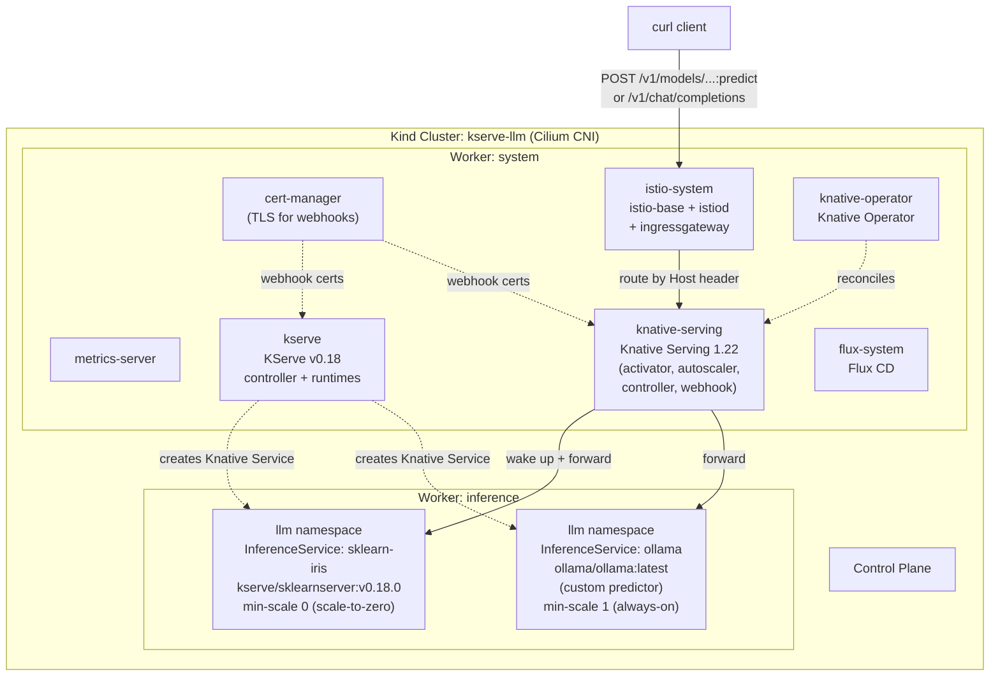
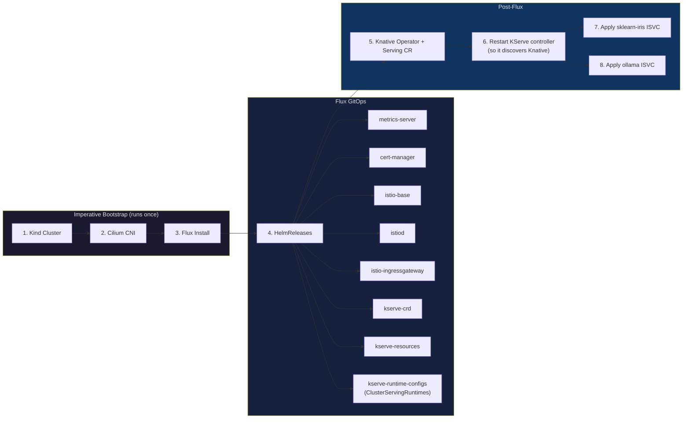
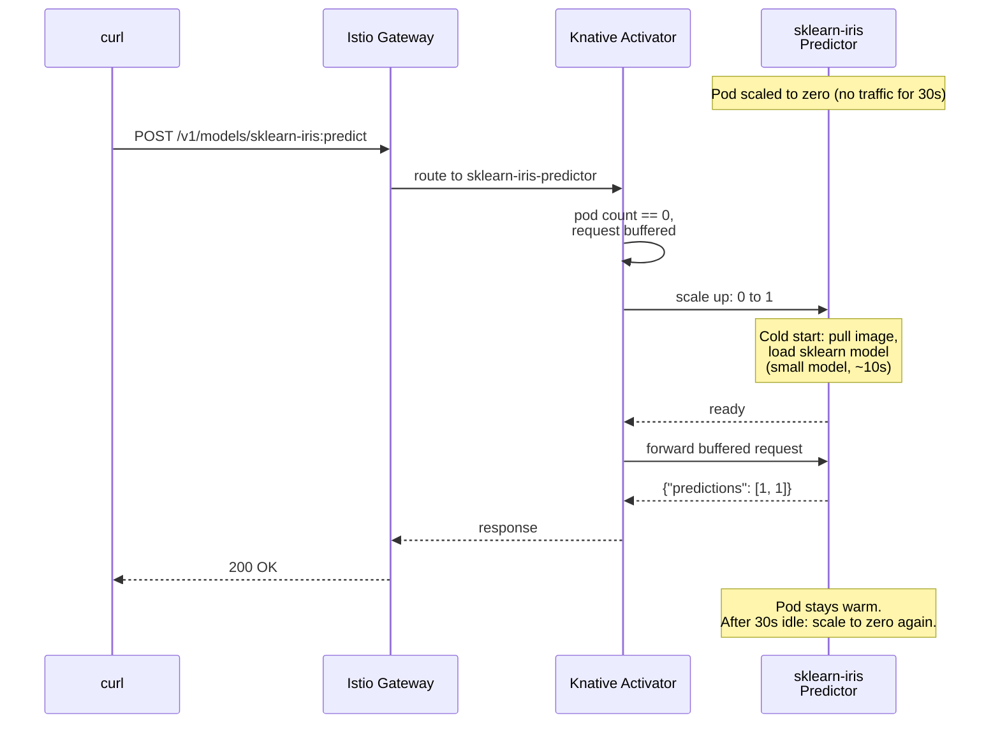
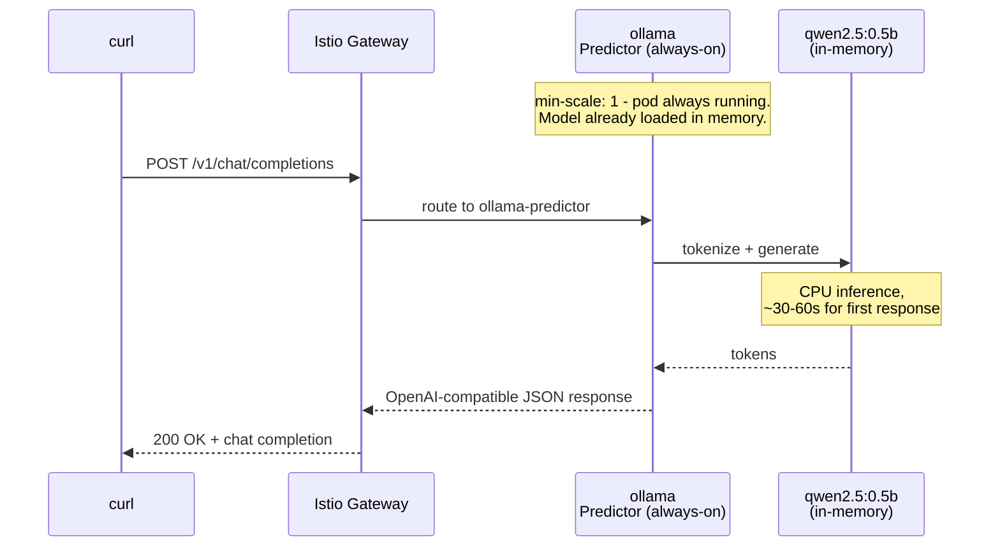

# KServe Demo - Predictive ML + Self-hosted LLM on Kubernetes

Hands-on demo for the blog post [KServe - Production ML Serving on Kubernetes, from sklearn to LLMs](https://srekubecraft.io/posts/kserve/).

This demo deploys **KServe v0.18** in Serverless mode on a local Kind cluster, then exposes two `InferenceService` resources side by side:

| ISVC | Model | Runtime | Endpoint | Scale-to-zero |
| --- | --- | --- | --- | --- |
| `sklearn-iris` | sklearn iris classifier | KServe `sklearnserver` (built-in) | `/v1/models/sklearn-iris:predict` | Yes |
| `ollama` | Qwen 2.5 0.5B Instruct | Ollama (custom predictor) | `/v1/chat/completions` (OpenAI-compatible) | No (`min-scale: 1`) |

Everything runs on CPU only - no GPU required. All architectures (amd64 + arm64) are supported because both `kserve/sklearnserver` and `ollama/ollama` ship multi-arch images.

> **Note**: KServe ships a built-in `kserve-huggingfaceserver` runtime for LLMs, but the v0.18.0 image is **amd64-only** at the time of writing. On Apple Silicon you'll hit `ImagePullBackOff`. The `qwen-isvc.yaml` manifest in this repo uses that runtime and is included as a reference for amd64/GPU hosts. The live demo on arm64 uses Ollama via the custom-predictor pattern, which serves an OpenAI-compatible chat API on any architecture.

## Architecture



### Setup flow - what's imperative vs GitOps



> **Why is the Knative Operator imperative?** The Knative Operator chart is published as a tarball on GitHub Releases (no Helm repository index, no OCI). Flux `HelmRepository` cannot consume it directly, so we install the operator with plain `helm`, then let Flux own everything else. The `KnativeServing` CR itself is a plain manifest in `kubernetes/knative/`.

> **Why restart the KServe controller after Knative comes up?** The KServe controller probes for Knative Serving CRDs at startup. If Knative is installed *after* the controller starts, the controller caches "Knative not available" and refuses to reconcile InferenceServices in Serverless mode. A rollout restart re-runs the probe.

### Request flow - sklearn predict



### Request flow - Ollama chat completion



### Why two InferenceServices?

| Aspect | sklearn-iris | Ollama |
| --- | --- | --- |
| **Use case** | Predictive ML (classification) | GenAI (chat completion) |
| **Runtime** | KServe built-in (`sklearnserver`) | Custom container (`ollama/ollama`) |
| **API surface** | KServe v1 protocol (`:predict`) | OpenAI-compatible (`/v1/chat/completions`) |
| **Cold start** | ~10s (small model) | ~5 min (re-pulls 400 MB model) |
| **Scale-to-zero** | Yes (`min-scale: 0`) | No (`min-scale: 1`) - cold start too painful |
| **Resources** | 100m / 512 Mi | 1 / 2 Gi |

Both are KServe `InferenceService` resources. The same controller, the same Knative ingress, the same scale-to-zero machinery - just different model formats and resource profiles.

## Prerequisites

| Tool | Version | Purpose |
| --- | --- | --- |
| [Docker](https://docs.docker.com/get-docker/) | 20+ | Container runtime for Kind. **Allocate at least 8 GB RAM in Docker Desktop.** |
| [Kind](https://kind.sigs.k8s.io/) | 0.20+ | Local Kubernetes cluster |
| [kubectl](https://kubernetes.io/docs/tasks/tools/) | 1.28+ | Kubernetes CLI |
| [Helm](https://helm.sh/docs/intro/install/) | 3.12+ | Cilium + Knative Operator install |
| [Cilium CLI](https://docs.cilium.io/en/stable/gettingstarted/k8s-install-default/#install-the-cilium-cli) | 0.15+ | CNI installation and health check |
| [Flux CLI](https://fluxcd.io/flux/installation/) | 2.0+ | GitOps controller |
| [Task](https://taskfile.dev/installation/) | 3.0+ | Task runner |
| [jq](https://jqlang.github.io/jq/download/) | 1.6+ | Pretty-print JSON responses |

## Quick Start

```bash
git clone https://github.com/nicknikolakakis/srekubecraft-demo.git
cd srekubecraft-demo/kserve

# Full setup: bootstrap -> Flux infra -> Knative -> sklearn ISVC -> Ollama ISVC
task setup
```

The setup takes approximately 15-25 minutes. Most of it is Flux reconciling, Knative coming up, and Ollama pulling the qwen2.5:0.5b model on first start.

### Phase 1 - imperative bootstrap (~5 min)

```bash
task bootstrap
```

1. Kind cluster - 1 control plane + 2 workers (system + inference)
2. Cilium - eBPF CNI (must be imperative - no pods without CNI)
3. Flux CD - GitOps controllers

### Phase 2 - Flux GitOps (~3-5 min)

```bash
task flux:apply
task flux:wait
```

| HelmRelease | Namespace | Version |
| --- | --- | --- |
| `metrics-server` | kube-system | 3.13.0 |
| `cert-manager` | cert-manager | v1.20.2 |
| `istio-base` | istio-system | 1.29.2 |
| `istiod` | istio-system | 1.29.2 |
| `istio-ingressgateway` | istio-system | 1.29.2 |
| `kserve-crd` | kserve | v0.18.0 |
| `kserve-resources` | kserve | v0.18.0 |
| `kserve-runtime-configs` | kserve | v0.18.0 |

> **Note**: `kserve-resources` will not become Ready until Knative Serving is up - it's wired in the next phase.

### Phase 3 - Knative Operator + Serving (~3-5 min)

```bash
task knative:install
```

Installs the Knative Operator (Helm tarball from GitHub) and applies the `KnativeServing` CR. The CR pins Knative Serving to **1.22.0**, picks **Istio** as the network layer, and tunes feature flags + autoscaler:

- `kubernetes.podspec-nodeselector: enabled` - InferenceService can pin to specific nodes
- `kubernetes.podspec-tolerations: enabled` - InferenceService can tolerate node taints
- `kubernetes.podspec-affinity: enabled` - InferenceService can use affinity rules
- `enable-scale-to-zero: true`
- `scale-to-zero-grace-period: 30s`
- `stable-window: 60s`

### Phase 4 - KServe controller restart + Ready (~1-2 min)

```bash
task flux:wait:kserve
```

Restarts the KServe controller manager so it discovers the just-installed Knative Serving CRDs, then waits for `kserve-resources` and `kserve-runtime-configs` to reconcile. The runtime-configs HelmRelease is what installs the `ClusterServingRuntime` resources (sklearn, xgboost, HuggingFace, triton, etc).

### Phase 5 - sklearn-iris (~1 min)

```bash
task isvc:apply
task isvc:wait
```

Applies an `InferenceService` named `sklearn-iris` in the `llm` namespace pointing at the public sklearn iris model in `gs://kfserving-examples/models/sklearn/1.0/model`. KServe creates a Knative Service and a tiny pod with the sklearn runtime.

### Phase 6 - Ollama (~3-5 min for model pull)

```bash
task isvc:apply-ollama
task isvc:wait-ollama
```

Applies an `InferenceService` named `ollama` using the **custom predictor** pattern. The `ollama/ollama` container starts the daemon, then `ollama pull qwen2.5:0.5b` downloads the ~400 MB model into the pod's filesystem. Once the daemon reports Ready, the OpenAI-compatible chat completions endpoint is live.

## Verify the Setup

### 1. All HelmReleases Ready

```bash
$ task flux:status
NAMESPACE       NAME                    REVISION   READY   MESSAGE
cert-manager    cert-manager            v1.20.2    True    Helm install succeeded
istio-system    istio-base              1.29.2     True    Helm install succeeded
istio-system    istio-ingressgateway    1.29.2     True    Helm install succeeded
istio-system    istiod                  1.29.2     True    Helm install succeeded
kserve          kserve-crd              v0.18.0    True    Helm install succeeded
kserve          kserve-resources        v0.18.0    True    Helm install succeeded
kserve          kserve-runtime-configs  v0.18.0    True    Helm install succeeded
kube-system     metrics-server          3.13.0     True    Helm install succeeded
```

### 2. Both InferenceServices Ready

```bash
$ task isvc:status
==> InferenceServices:
NAME           URL                                   READY   AGE
ollama         http://ollama.llm.example.com         True    5m
sklearn-iris   http://sklearn-iris.llm.example.com   True    7m

==> Predictor pods:
NAME                                                       READY   STATUS
ollama-predictor-00001-deployment-...                      2/2     Running
sklearn-iris-predictor-00001-deployment-...                2/2     Running
```

### 3. Predict against sklearn-iris

```bash
$ task test:predict
==> InferenceService URL: http://sklearn-iris.llm.example.com
==> Sending prediction (2 iris flowers)...

{
  "predictions": [
    1,
    1
  ]
}
```

### 4. Chat completion against Ollama (OpenAI-compatible)

```bash
$ task test:chat-ollama
==> Sending chat completion request to Ollama via in-cluster curl...
    (CPU LLM inference can take 30-90s for the first token)

{
  "id": "chatcmpl-805",
  "object": "chat.completion",
  "model": "qwen2.5:0.5b",
  "system_fingerprint": "fp_ollama",
  "choices": [
    {
      "index": 0,
      "message": {
        "role": "assistant",
        "content": "A Kubernetes Pod is a collection of containers that serve as units within a cluster and can be easily managed by the Kubernetes API server."
      },
      "finish_reason": "stop"
    }
  ],
  "usage": {
    "prompt_tokens": 31,
    "completion_tokens": 27,
    "total_tokens": 58
  }
}
```

### 5. Watch sklearn scale-to-zero

```bash
task test:scale-to-zero
```

Wait ~30-60 seconds with no traffic (the `scale-to-zero-grace-period: 30s` + `stable-window: 60s` we set on the KnativeServing CR). The sklearn predictor pod terminates. (Ollama stays warm because we set `min-scale: 1`.)

### 6. Trigger a sklearn cold start

```bash
task test:cold-start
```

Sends a prediction request after the pod scaled to zero. The Knative Activator buffers the request, scales the pod from 0 to 1, the model loads, and the response comes back. Total elapsed time is printed by `time`.

## Project Structure

```
kserve/
├── Taskfile.yml                              # All tasks
├── README.md
├── kubernetes/
│   ├── cluster/
│   │   └── kind-config.yaml                  # 3-node Kind: 1 CP + system + inference
│   ├── flux/
│   │   ├── sources.yaml                      # HelmRepositories: jetstack, istio, kserve OCI, metrics-server
│   │   ├── metrics-server-release.yaml       # HelmRelease: metrics-server
│   │   ├── cert-manager-release.yaml         # HelmRelease: cert-manager
│   │   ├── istio-release.yaml                # HelmReleases: base, istiod, ingressgateway
│   │   └── kserve-release.yaml               # HelmReleases: kserve-crd + kserve-resources + kserve-runtime-configs
│   ├── knative/
│   │   └── knative-serving.yaml              # KnativeServing CR (1.22.0, Istio network)
│   └── kserve/
│       ├── namespace.yaml                    # llm namespace
│       ├── sklearn-isvc.yaml                 # sklearn-iris InferenceService (live demo)
│       ├── ollama-isvc.yaml                  # Ollama InferenceService (LLM via custom predictor)
│       └── qwen-isvc.yaml                    # Reference: KServe HF runtime (amd64/GPU only)
└── ../shared/
    └── Taskfile.yml                          # Common tasks (cluster, cilium, flux, metrics)
```

## Available Tasks

| Task | Description |
| --- | --- |
| `setup` | Full setup: bootstrap -> Flux infra -> Knative -> sklearn + Ollama ISVCs |
| `bootstrap` | Imperative: Kind cluster + Cilium + Flux |
| `flux:apply` | Apply infrastructure HelmRepositories + HelmReleases |
| `flux:wait` | Wait for cert-manager + Istio + metrics-server |
| `flux:wait:kserve` | Restart KServe controller + wait for kserve-resources + runtime-configs |
| `flux:status` | Show all Flux HelmRelease status |
| `knative:install` | Install Knative Operator + apply KnativeServing CR |
| `knative:status` | Show Knative Serving CR + pods |
| `isvc:apply` | Deploy the sklearn-iris ISVC (live demo, multi-arch) |
| `isvc:apply-ollama` | Deploy the Ollama ISVC (custom predictor, multi-arch) |
| `isvc:apply-llm` | Deploy the KServe HF runtime ISVC (amd64/GPU only - reference) |
| `isvc:wait` | Wait for sklearn-iris to be Ready |
| `isvc:wait-ollama` | Wait for Ollama to be Ready (long timeout for model pull) |
| `isvc:status` | Show ISVCs, predictor pods, URL |
| `test:predict` | sklearn-iris prediction request (in-cluster curl) |
| `test:chat-ollama` | Ollama OpenAI-compatible chat completion (in-cluster curl) |
| `test:chat-qwen` | KServe HF runtime chat completion (amd64/GPU only - requires `isvc:apply-llm`) |
| `test:scale-to-zero` | Watch the sklearn pod scale to zero after no traffic |
| `test:cold-start` | Trigger and time a sklearn cold start |
| `clean:isvc` | Remove the InferenceServices + llm namespace |
| `clean` | Delete the Kind cluster |

## Stack Versions

| Component | Version | Managed by |
| --- | --- | --- |
| Cilium | 1.19.3 | Helm (imperative bootstrap) |
| Flux CD | 2.x latest | flux install (imperative bootstrap) |
| metrics-server | 3.13.0 | Flux HelmRelease |
| cert-manager | v1.20.2 | Flux HelmRelease |
| Istio | 1.29.2 | Flux HelmRelease (base + istiod + gateway) |
| Knative Operator | v1.22.0 | Helm (imperative post-Flux) |
| Knative Serving | 1.22.0 | KnativeServing CR (kubectl apply) |
| KServe | v0.18.0 | Flux HelmRelease (CRD + resources + runtime-configs, OCI) |
| sklearn iris model | gs://kfserving-examples | KServe storage-initializer |
| Ollama | latest | Custom predictor container |
| Qwen LLM | qwen2.5:0.5b | Pulled by Ollama on first start |
| Kubernetes (Kind) | 1.34+ | Kind |

## Design Decisions

### Why Serverless mode (Knative) instead of RawDeployment?

KServe v0.18 supports two deployment modes:

| Mode | Scale-to-zero | Cold start | Stack |
| --- | --- | --- | --- |
| **Serverless** (this demo) | Yes (Knative activator buffers requests) | Varies by model | Knative + Istio |
| **RawDeployment** | No (HPA-based scaling, min-replicas >= 1) | None (always running) | Plain Deployment + Service |

For predictive ML the cost of always-on pods is wasted compute. Scale-to-zero is the natural fit. For LLM serving you almost always want `min-scale: 1` because cold-start re-loads the model, which is unacceptable. Both patterns are demonstrated.

### Why Ollama instead of the KServe HuggingFace runtime?

The KServe v0.18 `kserve/huggingfaceserver` image is **amd64-only**. On Apple Silicon (arm64) the pod hits `ImagePullBackOff` because there's no arm64 manifest. Ollama, by contrast, ships multi-arch images and exposes an OpenAI-compatible chat API out of the box.

The KServe **custom predictor** pattern lets us drop in any container that listens on a port - no need to wait for upstream KServe arm64 builds. The cost is that we lose KServe-native niceties like the `storageUri:` model loader and the v2 inference protocol. We get the OpenAI API, which most LLM clients prefer anyway.

If you're on amd64 (or have a GPU node), `kubernetes/kserve/qwen-isvc.yaml` shows the canonical KServe HF runtime config - launch it with `task isvc:apply-llm`.

### Why a separate `inference` worker node?

In production you don't want the LLM pod (large memory footprint, GPU when applicable) competing with control plane components. Pinning the predictor to a dedicated node with `nodeSelector: workload: inference` simulates the GKE/EKS GPU nodepool pattern. The `kubernetes.podspec-nodeselector` Knative feature flag is what lets you do this on a Knative Service.

### Why install Knative imperatively?

The Knative Operator chart is shipped as a tarball on GitHub Releases (no Helm repo index, no OCI). Flux `HelmRepository` cannot consume it. The two clean alternatives are (a) re-publish the chart to your own OCI registry, or (b) run a `helm install` once. For a demo, (b) is honest and simple. The `KnativeServing` CR itself is a plain manifest under `kubernetes/knative/`, so the desired Knative state is still GitOps-friendly.

### Why restart the KServe controller after Knative comes up?

The KServe controller checks for Knative Serving CRDs at startup. If Knative is installed *after* the controller starts, the controller caches "Knative not available" and refuses to reconcile InferenceServices in Serverless mode. A `kubectl rollout restart deployment/kserve-controller-manager -n kserve` re-runs the probe and unsticks reconciliation. This is wired into the `flux:wait:kserve` task.

## Cleanup

```bash
# Remove the InferenceServices and llm namespace
task clean:isvc

# Delete the entire Kind cluster
task clean
```

## Blog Post

This demo accompanies the blog post: [KServe - Production ML Serving on Kubernetes, from sklearn to LLMs](https://srekubecraft.io/posts/kserve/)

## License

See the repository root [LICENSE](../LICENSE) file.
