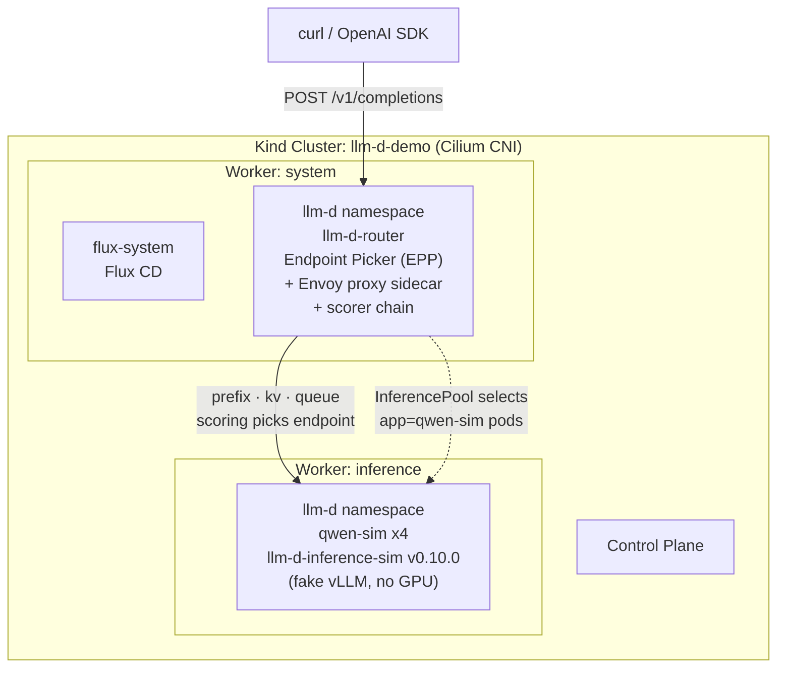
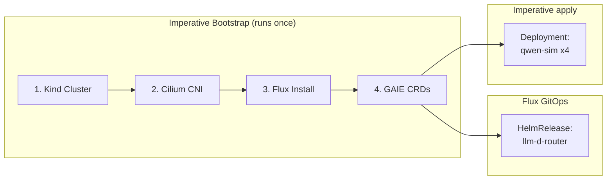

# llm-d Demo - Distributed LLM Inference on Kubernetes (GPU-free)

Hands-on demo for the blog post [llm-d - Kubernetes-Native Distributed LLM Inference at Scale](https://srekubecraft.io/posts/llm-d-distributed-inference/).

This demo runs the **llm-d** orchestration layer - the inference-aware router (Endpoint Picker + Envoy proxy) and an `InferencePool` - on a local Kind cluster, routing across four **simulated** vLLM model servers. It uses [`llm-d-inference-sim`](https://github.com/llm-d/llm-d-inference-sim), a lightweight OpenAI-compatible simulator that mimics vLLM (token streaming, prefix-cache hits, KV-cache and queue metrics) **without a GPU or a real model**.

| Component | What it is | Version |
| --- | --- | --- |
| llm-d router (standalone) | Endpoint Picker (EPP) + bundled Envoy proxy + `InferencePool` | chart `v0.9.0` |
| GAIE CRDs | Gateway API Inference Extension (`inference.networking.k8s.io`) | `v1.5.0` |
| Model servers | `llm-d-inference-sim` (fake vLLM), 4 replicas | `v0.10.0` |

**What this demo proves:** the control plane and inference-aware routing - the prefix-cache, KV-cache-utilization, and queue-depth scorers picking endpoints, and the `InferencePool` topology.

**What it does NOT prove:** real tokens/sec on real hardware. For that you need GPUs and the real vLLM image - see the "Production" section of the blog post.

> **Why the simulator?** The whole point of llm-d is distributing inference across GPUs, and GPUs are exactly what a laptop lacks. The sim lets you run the entire orchestration layer - scheduler, scorers, `InferencePool`, routing decisions - on commodity hardware, reproducibly. It is the same tool the llm-d maintainers use to test routing at scale in CI.

## Architecture



### Setup flow - imperative vs GitOps



## Prerequisites

- Docker Desktop (or Podman), 4 GB+ RAM
- [`kind`](https://kind.sigs.k8s.io) v0.23+, [`kubectl`](https://kubernetes.io/docs/tasks/tools/) v1.30+
- [`helm`](https://helm.sh) v3.12+, [`cilium`](https://cilium.io) CLI, [`flux`](https://fluxcd.io) v2.3+, [`jq`](https://jqlang.github.io/jq/), [`task`](https://taskfile.dev)

## Quick Start

```bash
task setup          # bootstrap -> GAIE CRDs -> router -> sim -> ready (~3-5 min)

task test:route     # two shared-prefix requests through the router
task test:metrics   # Endpoint Picker scorer metrics
task status         # router + InferencePool + sim pods

task clean          # delete the Kind cluster
```

## What `task test:route` shows

Two completion requests that share a long system prompt are sent through the router. The **prefix-cache scorer** should route the second one to the same sim pod that served the first, because that pod already holds the prompt's prefix in (simulated) cache - the opposite of round-robin. Inspect the scoring with `task test:metrics`.

## Troubleshooting

| Issue | Symptom | Resolution |
| --- | --- | --- |
| `InferencePool` CRD missing | HelmRelease fails: `no matches for kind InferencePool` | Run `task crds:apply` before `task flux:apply`. |
| Router pods `Pending` | EPP/proxy never schedule | The chart defaults to `cpu:4 / mem:8Gi`; this demo overrides both down in `router-release.yaml`. Confirm the override applied. |
| No metrics on `:9090` | `401`, or `500 Authentication failed` | The EPP metrics port is authenticated. `task metrics:rbac` binds `system:auth-delegator` to the EPP SA plus a `/metrics` reader; `task test:metrics` then mints a token for you. |
| Sim pods `CrashLoopBackOff` | `dial tcp [::1]:8082: connection refused` | The sim needs `--force-dummy-tokenizer` with a real HF model name. Already set in `sim-deployment.yaml`. |
| `port-forward` fails | Service not found | The Service is `llm-d-router-epp`. `llm-d-router` is the `HelmRelease` and `InferencePool` name. |
| Kind cluster will not create | `Bind for 0.0.0.0:80 failed: port is already allocated` | Another cluster or ingress controller holds host port 80. The demo only needs `port-forward`, so the `extraPortMappings` in the Kind config can be dropped. |
| All requests hit one pod | Uneven load for distinct prompts | Expected for shared-prefix traffic. For distinct prompts the `no-hit-lru-scorer` spreads them - send varied prompts to see it. |

## Notes on fidelity

- The sim omits the optional vLLM **render sidecar** (high-fidelity tokenization) to stay laptop-light. `--force-dummy-tokenizer` is what makes that safe: a real Hugging Face model name like `Qwen/Qwen3-0.6B` otherwise sends the sim down the HF tokenizer path, where it requires the render service on `:8082`.
- Scorer behaviour is approximate under the simulator. The routing *topology and decisions* are real; the *throughput numbers* are not.
- Versions are pinned to match llm-d v0.8.x `guides/env.sh` (GAIE `v1.5.0`, router chart `v0.9.0`).
