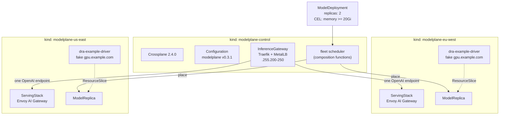

# Modelplane fleet demo: two regions, one front door, zero GPUs

A [Modelplane](https://github.com/modelplaneai/modelplane) control plane managing
**two** workload clusters, on a laptop, with no GPU and no cloud account.

Upstream's own e2e suite proves the control plane runs GPU-free, but it uses a
single workload cluster, so it never exercises the thing Modelplane exists for:
the **fleet scheduler**. This demo adds a second region and puts the scheduler on
the stand. Where do replicas land? What happens when you drain a cluster out from
under them?

## What makes it GPU-free

Two upstream primitives, neither of them a hack:

| Primitive | What it does here |
|---|---|
| `source: Existing` | The `InferenceCluster` registers a bring-your-own kind cluster by kubeconfig instead of provisioning EKS/GKE/AKS/Nebius/Vultr |
| `claim: DRA` + [dra-example-driver](https://github.com/kubernetes-sigs/dra-example-driver) | The `InferenceClass` advertises `gpu.example.com` devices published by a fake driver, so the engine's `ResourceClaim` binds a fake device on a GPU-less node and the **real DRA allocation path runs** |

A claimable device is required: the fleet scheduler rejects an engine whose only
device is `Synthetic`. The engine itself is a mock server, 30 lines of Python
stdlib answering `/v1/chat/completions` and `/v1/messages` the way vLLM does, so
the pod goes Ready with no model and no GPU.

## Shape



Three kind clusters on one Docker network. Every MetalLB pool has to sit inside
that network's real subnet and stay disjoint from the others, or cross-cluster
routing silently times out:

| Cluster | Role | MetalLB pool |
|---|---|---|
| `modelplane-control` | Crossplane, Modelplane APIs, Traefik front door | `.255.200-.250` (composed by Modelplane) |
| `modelplane-eu-west` | serving stack, fake GPUs | `.255.100-.119` |
| `modelplane-us-east` | serving stack, fake GPUs | `.255.120-.139` |

The Taskfile detects the subnet at runtime; kind bumps off `172.18` when earlier
Docker networks already hold it.

## Prerequisites

- **Docker with 24 GB of memory.** Three kind clusters and two full serving
  stacks (cert-manager, Envoy Gateway, Envoy AI Gateway, GAIE, LeaderWorkerSet,
  NFD, kube-prometheus-stack) do not fit in the 8 GB default. Docker Desktop →
  Settings → Resources → Advanced → Memory. `task check` enforces 20 GB.
- `kind`, `kubectl`, `helm`, `jq`, `task`
- Workload clusters are pinned to **Kubernetes v1.34** for the `resource.k8s.io`
  (DRA) APIs. The node image is pinned by digest: kind v0.31+ defaults to
  containerd 2.2.0, which breaks Modelplane.

## Run it

```bash
task up          # clusters -> workloads -> control plane -> register -> deploy
task placement   # where did each replica land?
task curl        # one request through the single front door
```

Step by step, which is how you should watch it the first time:

```bash
task clusters      # three kind clusters
task workloads     # MetalLB + fake DRA GPUs + pool labels on both regions
task controlplane  # Crossplane + the Modelplane Configuration
task register      # both InferenceClusters, the class, the gateway
task deploy        # the ModelDeployment + ModelService
```

## The drain

The point of a fleet. Tainting an `InferenceCluster` is the fleet-level
`kubectl drain`:

```bash
task drain CLUSTER=gpu-eu-west     # NoExecute: move the replicas that are there
task placement                     # watch them reappear elsewhere
task undrain CLUSTER=gpu-eu-west   # nothing moves back on its own
```

When no other cluster can take a replica, the deployment runs below
`spec.replicas` and says so in its `ReplicasScheduled` condition, rather than
failing silently.

## Gotchas

**The getting-started `configuration.yaml` lags a release at every tag.** The copy
at tag `v0.3.1` still pins the package `v0.3.0`; only `main` pins `v0.3.1`. Follow
the install docs from a tag and you get the previous release without being told.

That matters here because **v0.3.0's package ships a CEL rule the API server
rejects**, so the `ModelDeployment` and `ModelReplica` XRDs never establish:

```
EstablishComposite: cannot apply rendered composite resource CustomResourceDefinition:
  "modelreplicas.modelplane.ai" is invalid: x-kubernetes-validations[1].rule:
  compilation failed: ERROR: <input>:1:51: Syntax error: token recognition error
```

The label-key regex reaches CEL as `\.`, an invalid escape in a CEL string
literal. Fixed upstream in
[#400](https://github.com/modelplaneai/modelplane/pull/400) and backported in
[#403](https://github.com/modelplaneai/modelplane/pull/403), both in the v0.3.1
package. This demo pins the Configuration itself in
`kubernetes/modelplane/configuration.yaml` rather than fetching the docs copy.

The failure is worth knowing how to spot, because it is silent. The XRD carries
**no status conditions at all**, nothing appears in the Crossplane logs, and the
only symptom downstream is an `InferenceCluster` stuck at `SYNCED=False` with
`no matches for kind "ModelReplica"`. The evidence lives in events:

```bash
kubectl get events -A --field-selector type=Warning | grep EstablishComposite
```

**Do not upgrade v0.3.0 to v0.3.1 in place.** v0.3.1 moved provider-helm and
provider-kubernetes from the `modelplane` fork to the `upbound` org
([#390](https://github.com/modelplaneai/modelplane/pull/390)). Upgrading leaves
both installed and they deadlock:

```
upbound-provider-helm  Healthy=False  UnhealthyPackageRevision:
  cannot establish control of object: releases.helm.m.crossplane.io is already
  controlled by ProviderRevision modelplane-provider-helm-840f6120b7c2
```

The old fork keeps the CRDs, so the new provider never starts, while the RBAC
`prerequisites.yaml` grants is bound to the *new* provider's service account. The
old one then runs unprivileged and fails with `namespaces is forbidden`. A clean
install never sees this; the Taskfile pins v0.3.1 from the start.

**Engine pods stuck in `ContainerCreating` with no events: kubelet 1.34.0 DRA
deadlock.** The `ResourceClaim` shows `allocated,reserved`, the pod has only a
`Scheduled` event, the kubelet logs nothing, and the DRA plugin never receives a
`NodePrepareResources` call with a claim. A kubelet goroutine dump
(`/debug/pprof/goroutine?debug=1` via the node proxy) shows the pod worker blocked
in `NodePrepareResources → grpc idle.ExitIdleMode` while the kubelet's own plugin
monitor holds the same lock from inside the connection-close callback. It fires
after the kubelet-to-driver gRPC connection idles for 30 minutes, so short runs
never see it and a cluster left overnight always does. Fixed upstream in
[kubernetes#133926](https://github.com/kubernetes/kubernetes/pull/133926),
cherry-picked to 1.34 in
[#133934](https://github.com/kubernetes/kubernetes/pull/133934), shipped in
**v1.34.2+**. Workaround on an affected node:

```bash
docker exec <node> systemctl restart kubelet
```

The catch: Modelplane's docs pin `kindest/node:v1.34.0` because newer kind images
ship containerd 2.2+, which upstream says breaks Modelplane
([#315](https://github.com/modelplaneai/modelplane/issues/315), no detail given).
`v1.34.8` carries containerd 2.3.1.

**Order the lean trim before the Configuration.** `lean-control-plane.yaml`
scales the ten cloud providers to zero, but an `ImageConfig` binds at
`ProviderRevision` creation, so applying it afterwards leaves the controllers
running. Applied first, the whole control plane is 15 pods.

## Teardown

```bash
task down
```

## Layout

```
modelplane-fleet/
  Taskfile.yml
  kubernetes/
    clusters/            # three kind configs, node image pinned by digest
    modelplane/
      00-namespaces.yaml
      10-inference-gateway.yaml   # Traefik front door, MetalLB pool templated
      20-inference-class.yaml     # platform side: the device vocabulary
      30-inference-clusters.yaml  # two BYO clusters, region-labelled
      40-model-deployment.yaml    # developer side: CEL over that vocabulary
      50-model-service.yaml       # one endpoint in front of every replica
```

The bootstrap RBAC, the cloud-provider trims, and the fake DRA driver are pulled
from upstream at the pinned tag `v0.3.1` rather than vendored.

## Credit

The GPU-free approach is upstream's, from
[`e2e/`](https://github.com/modelplaneai/modelplane/tree/v0.3.1/e2e). What this
demo adds is the second region.
