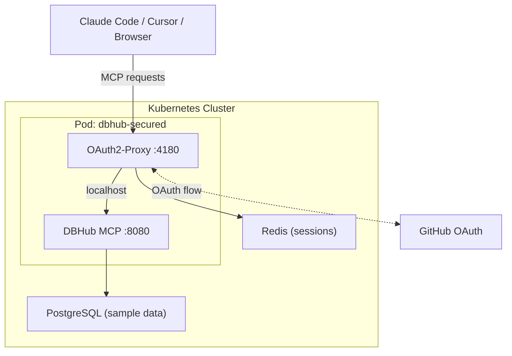
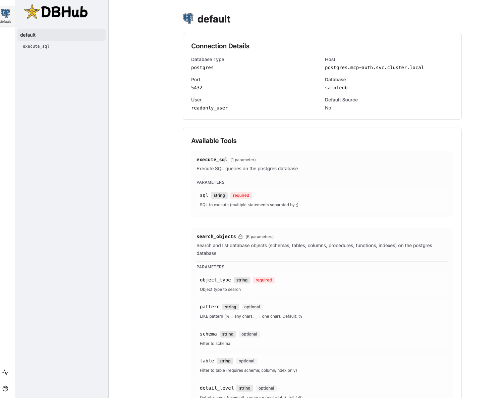
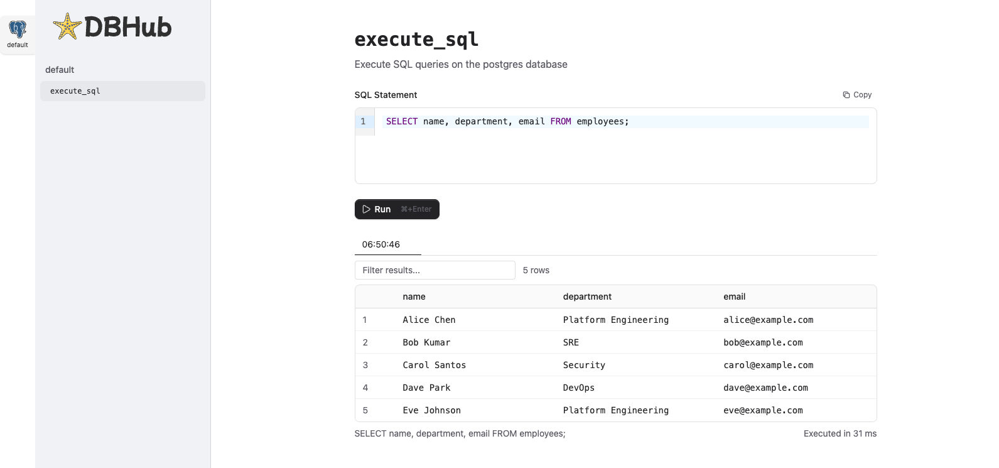

# OAuth2-Proxy + MCP Server Demo

Secure self-hosted MCP servers on Kubernetes with OAuth2-Proxy.

> Blog post: [OAuth2-Proxy - Securing MCP Servers on Kubernetes Before Hackers Find Them First](https://srekubecraft.io/posts/oauth2-proxy/)

## Architecture



**How it works**: OAuth2-Proxy runs as a sidecar in the same Pod as DBHub. All MCP traffic enters through the proxy on port 4180. Unauthenticated requests get a 403 sign-in page. Authenticated requests (with a valid session cookie) are forwarded to DBHub on localhost:8080.

## Prerequisites

| Tool | Version | Install |
| --- | --- | --- |
| [kind](https://kind.sigs.k8s.io/) | v0.27+ | `brew install kind` |
| [kubectl](https://kubernetes.io/docs/tasks/tools/) | v1.32+ | `brew install kubectl` |
| [helm](https://helm.sh/) | v3.17+ | `brew install helm` |
| [cilium](https://docs.cilium.io/en/stable/gettingstarted/k8s-install-default/) | v0.16+ | `brew install cilium-cli` |
| [task](https://taskfile.dev/) | v3.40+ | `brew install go-task` |

### GitHub OAuth App

You need a GitHub OAuth App for authentication:

1. Go to [GitHub Developer Settings](https://github.com/settings/developers)
2. Click **New OAuth App**
3. Set:
   - **Application name**: `oauth2-proxy-mcp-demo`
   - **Homepage URL**: `http://dbhub.localhost`
   - **Authorization callback URL**: `http://dbhub.localhost/oauth2/callback`
4. Click **Register application**
5. Click **Generate a new client secret**
6. Note the **Client ID** and **Client Secret**

## Quick Start

```bash
git clone https://github.com/nicknikolakakis/srekubecraft-demo.git
cd srekubecraft-demo/oauth2-proxy-mcp

# Full setup (will prompt for GitHub OAuth credentials)
task setup

# Cleanup
task clean
```

## Testing the Security

After `task setup` completes, start a port-forward to expose DBHub:

```bash
sudo kubectl -n mcp-servers port-forward svc/dbhub-sidecar 80:4180
```

### 1. Without authentication: MCP request blocked

An AI agent (or curl) without a session cookie gets blocked:

```bash
curl -s -w "\nHTTP Status: %{http_code}\n" \
  -X POST http://dbhub.localhost/mcp \
  -H "Content-Type: application/json" \
  -H "Accept: application/json, text/event-stream" \
  -d '{"jsonrpc":"2.0","id":1,"method":"tools/call","params":{"name":"execute_sql","arguments":{"sql":"SELECT * FROM employees"}}}'
```

**Result**: `401 Unauthorized` with empty response. No data returned. Browsers get a 403 with a "Sign in with GitHub" page instead.

### 2. Authenticate via browser

1. Open `http://dbhub.localhost` in your browser
2. Click **Sign in with GitHub**
3. Authorize the app
4. You land on the DBHub web UI with access to the MCP tools:



5. Run a query like `SELECT name, department, email FROM employees`:



### 3. Attacker inside the cluster: still blocked by OAuth2-Proxy

Even from inside the cluster, hitting the DBHub service goes through OAuth2-Proxy (the only exposed port is 4180):

```bash
kubectl run attacker --rm -it --restart=Never --image=curlimages/curl -n default -- \
  curl -s -w "\nHTTP Status: %{http_code}\n" \
  -X POST http://dbhub-sidecar.mcp-servers.svc.cluster.local:4180/mcp \
  -H "Content-Type: application/json" \
  -H "Accept: application/json, text/event-stream" \
  -d '{"jsonrpc":"2.0","id":1,"method":"tools/call","params":{"name":"execute_sql","arguments":{"sql":"SELECT * FROM employees"}}}'
```

**Result**: `401 Unauthorized`. OAuth2-Proxy blocks the request because there is no valid session cookie. DBHub port 8080 is not exposed as a Service - it is only reachable on localhost inside the pod.

### 4. With NetworkPolicy: block all pod traffic

Apply NetworkPolicies to further restrict which namespaces can reach the sidecar service:

```bash
task demo:netpol

kubectl run attacker --rm -it --restart=Never --image=curlimages/curl -n default -- \
  curl -s --max-time 5 -w "\nHTTP Status: %{http_code}\n" \
  -X POST http://dbhub-sidecar.mcp-servers.svc.cluster.local:4180/mcp \
  -H "Content-Type: application/json" \
  -H "Accept: application/json, text/event-stream" \
  -d '{"jsonrpc":"2.0","id":1,"method":"tools/call","params":{"name":"execute_sql","arguments":{"sql":"SELECT * FROM employees"}}}'
```

**Result**: Connection timeout. The NetworkPolicy blocks all traffic to the pod except from allowed namespaces.

### Summary

| Scenario | Result |
| --- | --- |
| Unauthenticated request (curl) | **401 Unauthorized** - no data |
| Unauthenticated request (browser) | **403** with "Sign in with GitHub" page |
| Authenticated via GitHub (browser) | **Data returned** via DBHub web UI |
| Attacker pod inside cluster | **401 Unauthorized** - no valid session |
| Attacker pod with NetworkPolicy applied | **Connection timeout** - network blocked |

## Project Structure

```
oauth2-proxy-mcp/
├── Taskfile.yml                              # Task automation
├── README.md                                 # This file
└── kubernetes/
    ├── cluster/
    │   └── kind-config.yaml                  # Kind: 3 nodes, Cilium, no kube-proxy
    ├── cilium/
    │   └── values.yaml                       # Cilium Helm values
    ├── oauth2-proxy/
    │   ├── 01-namespace.yaml                 # mcp-auth namespace
    │   ├── 02-secret.yaml                    # Secret template
    │   └── 03-deployment.yaml                # Deployment + Service
    ├── dbhub/
    │   ├── 01-namespace.yaml                 # mcp-servers namespace
    │   ├── 02-secret.yaml                    # Database connection DSN
    │   └── 03-sidecar-deployment.yaml        # DBHub + OAuth2-Proxy sidecar
    ├── redis/
    │   └── 01-deployment.yaml                # Redis for session storage
    ├── postgres/
    │   └── 01-deployment.yaml                # PostgreSQL + init script + sample data
    └── policies/
        └── 01-dbhub-isolation.yaml           # NetworkPolicies
```

## Available Tasks

| Task | Description |
| --- | --- |
| `task setup` | Full setup: cluster + Cilium + infra + DBHub + OAuth2-Proxy |
| `task demo:netpol` | Apply NetworkPolicies for pod isolation |
| `task check` | Verify required tools |
| `task cluster:create` | Create Kind cluster |
| `task cluster:delete` | Delete Kind cluster |
| `task cilium:install` | Install Cilium CNI |
| `task infra:redis` | Deploy Redis |
| `task infra:postgres` | Deploy PostgreSQL |
| `task oauth2-proxy:secret` | Create OAuth2-Proxy secret (interactive) |
| `task clean:services` | Remove services (keep cluster) |
| `task clean` | Delete everything |

## Stack Versions

| Component | Version |
| --- | --- |
| Kind | v0.27+ |
| Cilium | 1.19.0 |
| OAuth2-Proxy | v7.15.1 |
| DBHub | latest |
| Redis | 7 (Alpine) |
| PostgreSQL | 16 (Alpine) |

## Sample Database

The demo deploys PostgreSQL with two tables:

- **employees** - 5 rows (name, department, email, hire_date)
- **incidents** - 4 rows (title, severity, status, assignee)

DBHub connects with a `readonly_user` that only has `SELECT` privileges.

## Cleanup

```bash
# Remove services but keep the cluster
task clean:services

# Delete everything including the cluster
task clean
```

## Blog Post

[OAuth2-Proxy - Securing MCP Servers on Kubernetes Before Hackers Find Them First](https://srekubecraft.io/posts/oauth2-proxy/)

## License

Apache 2.0
